

   <h1>BudApp  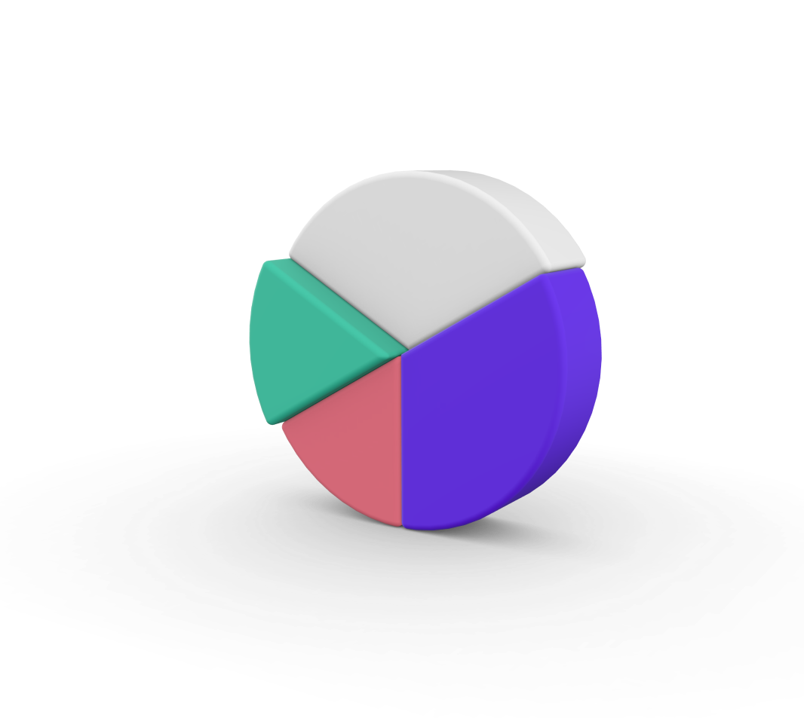</h1>

   <h2>Sobre o projeto 📘</h2>
  
  

 O BudApp é um sistema de orçamento online desenvolvido para ajudar empresas e empreendedores a gerenciar suas finanças de maneira mais eficiente. Nós criamos o sistema com o objetivo de oferecer uma solução prática e fácil de usar para quem busca mais praticidade e agilidade no gerenciamento de seus orçamentos. Com o BudApp, é possível inserir, editar e excluir orçamentos de forma simples e rápida, tudo em um só lugar.
A interface do BudApp foi projetada com base na usabilidade e simplicidade, para que qualquer pessoa possa usá-lo sem dificuldades. Além disso, o sistema é acessível de qualquer dispositivo com conexão à internet, permitindo que o usuário possa gerenciar suas finanças de qualquer lugar, a qualquer hora.
Acreditamos que o BudApp é uma solução completa e eficiente para quem busca mais controle e praticidade na gestão financeira de seu negócio. Esperamos que possa experimentá-lo em breve e ver como ele pode ser útil para você e sua empresa.
  

   
   <h2>Video de apresentação do projeto</h2> Clique na imagem para assistir:   
   
   

     <a href="https://youtu.be/-ZAR6JhDkoE"></img></a>
  

  
  <h2>Tela do sistema 🖥</h2>
  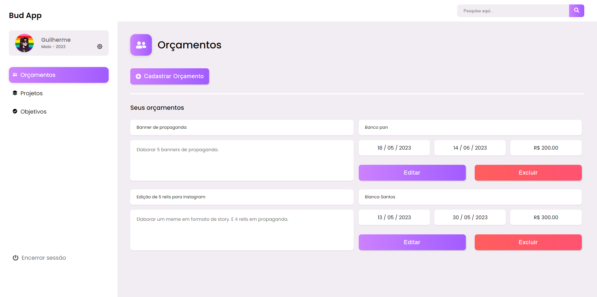
  
  <h2 align='center'>Tecnologias 👨‍💻</h2>
   
  

     
     
     
     
     
     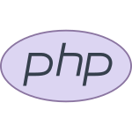
     
  
  
  
  

   <h2>Indentidade visual 🎨</h2>
          
  
  
   
 
   
   <h2>Passo a passo de como testar o projeto na sua maquina 📜</h2>
   <h3>Primeira etapa</h3>
   
   <ul>
      <li>Baixar o Xamp</li>
   </ul>
   
   
Basta seguir o passo a passo da instalação no seu desktop

   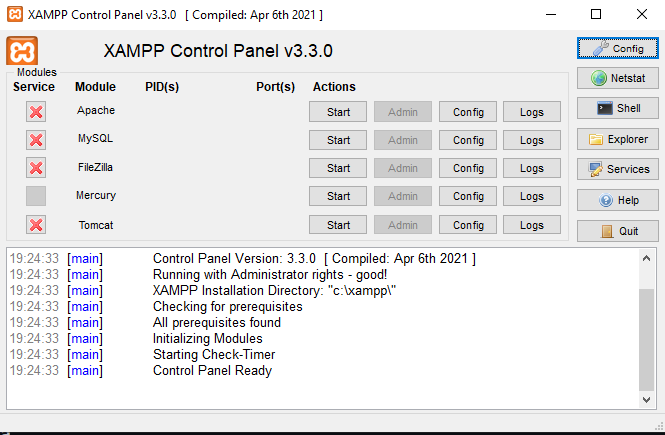  
   <a href="https://www.apachefriends.org/pt_br/download.html">Link de download</a>
   
   <h3>Segunda etapa:</h3>
   <ul>
      <li>Baixar o repositório</li>
   </ul>
   
   

      É muito simples. Clique no botão <strong>Code</strong> e depois escolha Dowload ZIP. É a opção mais simples e rápida.
   

   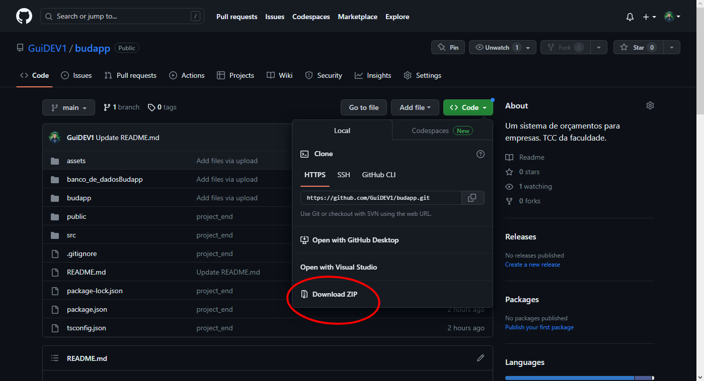    
   
   

      Obs: Para abrir esse arquivo zip você tem que ter algum programa que faça isso. Minha sugestão Winrar deixarei link abaixo.
      E outro lembrete também se caso você não tiver o Node JS instalado o react não vai funcionar deixarei o link dele também.
   

    <a href="https://www.win-rar.com/start.html?&L=9">Link para baixar o Winrar</a>  
    <a href="https://nodejs.org/en/download">Link para baixar Node JS</a>
   
   <h3>Terceira etapa:</h3>
   <ul>
      <li>
         Agora que você ja baixo os arquivos extraia em uma pasta nova no seu computador, de preferência aonde você não se perca. Depois abra ela. Você tera que fazer uns ajustes vamos la!. Primeiro crie uma
         pasta com um nome que fique facil de você indentificar dentro dela vai ficar todo o front-end. Após criar selecione todos esses arquivos como na imagem abaixo. Agora como na imagem 2 selecione essas três 
         pastas com exceção da pasta assets, e mova elas para pasta <strong>htdocs</strong> que está dentro da pasta XAMP no disco aonde você baixo o programa.
      </li>
   </ul>  
   
   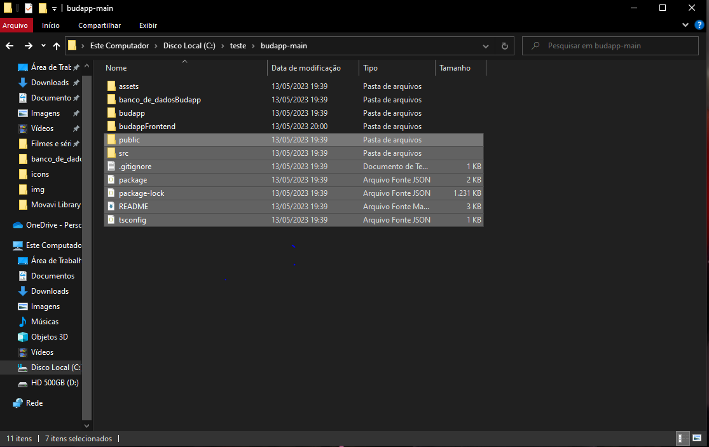  

   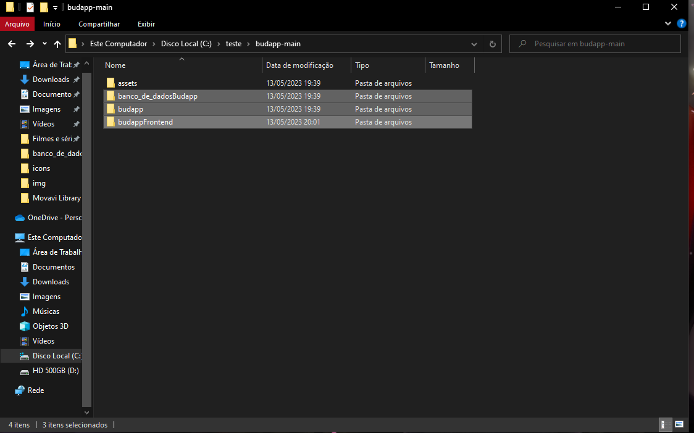 

   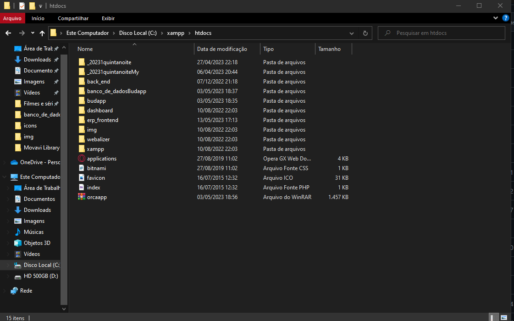  
   
   <h3>Quarta etapa:</h3>
   <ul>
      <li>
         Agora vamos importa o arquivo sql no banco. Abra seu Xamp de preferência como administrador para evitar bugs, agora de start no apache para rodar o php, e no mySQL para 
         rodar o banco de dados.
      </li>
   </ul>
   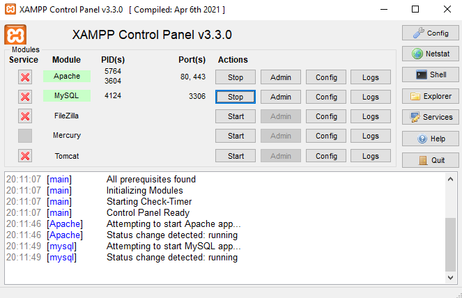  
    <ul>
      <li>
        Após isso clique em Admin para abrir PHPadmin no seu navegador. Agora seguindo as imagens abaixo crie um novo banco com o mesmo nome da pasta budapp.
         Se o banco não tiver o mesmo nome o sistema não ira fucionar. Proximo passo é ir na opção importa com o banco selecionado e abrir a pasta banco_de_dadosBudapp
         e escolher o arquivo <strong>budapp.sql</strong> não precisa mecher em nada so clicar em importa depois de importado seu banco ta pronto.
      </li>
   </ul>  
         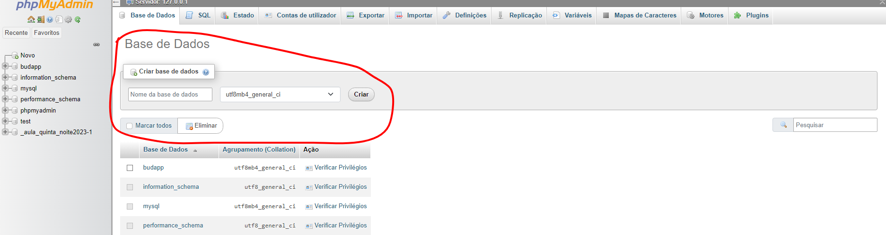 

         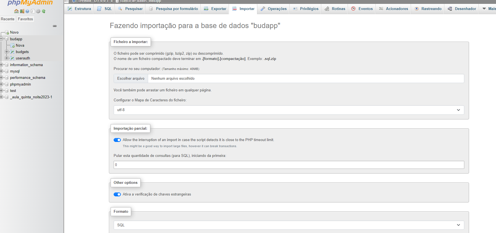
         
   <h3>Ultima etapa:</h3>
    <ul>
      <li>
         Falta pouco!. agora abra seu Vs code, abra a pasta que ta o front-end somente essa pasta!. abra o terminal como nas imagens abaixo primeiro execute o codigo <li>npm istall nome da sua pasta</li>.
         Espere baixar todas dependências do app react quando termina execute o segundo comando <li>npm start</li> para executar o projeto e poder aproveitar nossa plataforma.
      </li>
   </ul>

                                                             npm install     
   <h2>Se gostou do projeto favorite 🌟</h2>

